# Automated Market Intelligence Pipeline with Forecasting and Financial Dashboard

A Python-based market data pipeline that ingests financial market data, stores it in a local analytical database, engineers financial features, trains baseline forecasting models, generates trading signals, and presents results through an interactive Streamlit dashboard.

> **Project note:**
> This project began as a personal learning project to understand the full data pipeline lifecycle: ingestion, storage, transformation, feature engineering, modelling, evaluation, and dashboarding. Some parts of the repository are experimental or messy, but the core pipeline works.
>
> For the most polished and presentation-ready work, please review the notebooks and reports inside the `/notebooks` directory.

---

## Project Overview

This project explores how financial market data can be turned into useful analysis and decision-support tools through a repeatable data pipeline.

The system is designed to:

1. Pull historical market data from `yfinance`.
2. Store raw and processed data in a local DuckDB database.
3. Clean and validate market data using pandas.
4. Create financial features such as returns, volatility, moving averages, and drawdowns.
5. Train baseline forecasting and classification models using scikit-learn.
6. Generate simple trading and risk signals.
7. Display insights through an interactive Streamlit dashboard.
8. Run the workflow as a repeatable pipeline using Prefect.

---

## Why This Project Matters

This project demonstrates skills across four areas:

| Area                   | Skills Demonstrated                                                                        |
| ---------------------- | ------------------------------------------------------------------------------------------ |
| **Data Engineering**   | API ingestion, pipeline design, local database storage, orchestration, data validation     |
| **Data Analysis**      | KPI calculation, SQL analysis, trend analysis, dashboarding, financial interpretation      |
| **Data Science**       | Feature engineering, forecasting, classification, model evaluation, time-series validation |
| **Financial Analysis** | Returns, volatility, drawdowns, Sharpe ratio, moving averages, trading signals             |

The aim is not to create a production trading system. Instead, the goal is to show an end-to-end understanding of how raw financial data can be collected, cleaned, modelled, evaluated, and communicated.

---

## Core Technology Stack

| Tool                  | Purpose                                            |
| --------------------- | -------------------------------------------------- |
| **Python**            | Main programming language                          |
| **pandas**            | Data cleaning, transformation, feature engineering |
| **yfinance**          | Market data source                                 |
| **DuckDB**            | Local analytical database                          |
| **SQL**               | Data analysis and validation                       |
| **scikit-learn**      | Forecasting and classification models              |
| **Streamlit**         | Interactive dashboard                              |
| **Prefect**           | Pipeline orchestration                             |
| **Jupyter Notebooks** | EDA, modelling experiments, reporting              |

---

## Selected Assets

The project currently focuses on a small basket of assets:

```python
TICKERS = ["SPY", "GLD", "TLT", "SNDK", "MU", "RPI.L", "NKE"]
```

These assets were chosen to provide exposure to different market categories:

| Asset | Category                       |
| ----- | ------------------------------ |
| SPY   | US equity market ETF           |
| GLD   | Gold / commodity ETF           |
| TLT   | Long-term US Treasury bond ETF |
| SNDK  | Individual equity              |
| MU    | Semiconductor equity           |
| RPI.L | UK-listed equity               |
| NKE   | Consumer discretionary equity  |

---

## System Architecture

```mermaid
flowchart LR
    A[yfinance API] --> B[Raw Market Data]
    B --> C[DuckDB: raw_prices]
    C --> D[Cleaning and Validation]
    D --> E[DuckDB: clean_prices]
    E --> F[Feature Engineering]
    F --> G[DuckDB: price_features]
    G --> H[Forecasting Models]
    H --> I[DuckDB: model_predictions]
    I --> J[Trading Signals]
    J --> K[Backtesting]
    K --> L[Strategy Comparison]
    I --> M[Streamlit Dashboard]
    L --> M
```



---

## Data Pipeline

The project follows a structured data pipeline:

```text
Market API
   ↓
Raw CSV files
   ↓
DuckDB raw_prices table
   ↓
Data cleaning and validation
   ↓
DuckDB clean_prices table
   ↓
Feature engineering
   ↓
DuckDB price_features table
   ↓
Model training and prediction
   ↓
DuckDB model_predictions table
   ↓
Trading signal generation
   ↓
Backtesting and dashboarding
```

---

## Project Structure

```text
market-data-pipeline/
│
├── data/
│   ├── raw/
│   │   └── prices_raw.csv
│   ├── processed/
│   └── market.duckdb
│
├── notebooks/
│   ├── 01_exploration.ipynb
│   ├── 02_feature_engineering.ipynb
│   ├── 03_modelling.ipynb
│   └── reports/
│
├── src/
│   ├── ingest.py
│   ├── database.py
│   ├── transform.py
│   ├── features.py
│   ├── model.py
│   ├── signals.py
│   └── backtest.py
│
├── app/
│   └── dashboard.py
│
├── flows/
│   └── prefect_flow.py
│
├── requirements.txt
└── README.md
```

---

## Pipeline Stages

### 1. Market Data Ingestion

The ingestion stage downloads historical market data for the selected tickers using `yfinance`.

The ingestion script:

* Accepts a list of ticker symbols.
* Downloads historical OHLCV market data.
* Saves the raw data before transformation.
* Adds metadata columns such as ticker and download timestamp.

Expected raw output:

```text
data/raw/prices_raw.csv
```

Expected columns:

| Column         | Description             |
| -------------- | ----------------------- |
| date           | Trading date            |
| open           | Opening price           |
| high           | Highest price           |
| low            | Lowest price            |
| close          | Closing price           |
| adjusted_close | Adjusted closing price  |
| volume         | Trading volume          |
| ticker         | Asset ticker            |
| downloaded_at  | Data download timestamp |

Raw data is intentionally saved before cleaning so that errors can be traced and debugged later.

---

### 2. DuckDB Storage

The project uses DuckDB as a lightweight local analytical database.

DuckDB was chosen because it is:

* Easy to use locally.
* SQL-friendly.
* Fast for analytical queries.
* Well integrated with Python and pandas.
* Suitable for CSV and Parquet-based workflows.

Main database:

```python
data/market.duckdb
```

Core tables:

| Table                 | Purpose                                       |
| --------------------- | --------------------------------------------- |
| `raw_prices`          | Raw ingested market data                      |
| `clean_prices`        | Validated and cleaned price data              |
| `price_features`      | Financial features for analysis and modelling |
| `model_predictions`   | Model outputs and predicted values            |
| `strategy_comparison` | Backtest results and strategy metrics         |
| `pipeline_runs`       | Pipeline execution metadata                   |

Example validation query:

```sql
SELECT 
    ticker,
    COUNT(*) AS row_count
FROM raw_prices
GROUP BY ticker;
```

---

### 3. Data Cleaning and Validation

The cleaning stage turns raw market data into analysis-ready data.

Validation checks include:

* Correct data types.
* Missing value handling.
* Duplicate ticker-date detection.
* Date validation.
* Price sanity checks, such as prices greater than zero.
* OHLC consistency checks, such as `high >= low`.
* Ticker validation.
* Sorting by ticker and date.
* Row count reporting by ticker.
* Date range reporting by ticker.

Expected clean table:

```text
clean_prices
```

Example quality-control query:

```sql
SELECT 
    ticker,
    MIN(date) AS first_date,
    MAX(date) AS last_date,
    COUNT(*) AS rows
FROM clean_prices
GROUP BY ticker;
```

Success criteria:

* No duplicate ticker-date rows.
* No invalid prices.
* Clean date ordering.
* Consistent row counts by ticker.
* Clear reporting of missing or removed data.

---

### 4. Feature Engineering

The feature engineering stage creates financial indicators used for analysis, modelling, and signal generation.

Features include:

| Feature                  | Description                                                |
| ------------------------ | ---------------------------------------------------------- |
| `daily_return`           | Percentage return from one trading day to the next         |
| `log_return`             | Logarithmic daily return                                   |
| `rolling_7d_return`      | Rolling 7-day return                                       |
| `rolling_30d_return`     | Rolling 30-day return                                      |
| `rolling_30d_volatility` | Rolling 30-day volatility                                  |
| `moving_avg_20`          | 20-day moving average                                      |
| `moving_avg_50`          | 50-day moving average                                      |
| `price_vs_ma20`          | Difference between current price and 20-day moving average |
| `target_next_day_return` | Next-day return used as a prediction target                |

Some rows are dropped after feature creation because rolling calculations require historical windows. For example, a 30-day volatility feature cannot be calculated for the first 29 rows of each ticker.

Expected feature table:

```text
price_features
```

Success criteria:

* Each feature can be explained in plain English.
* Feature calculations are grouped correctly by ticker.
* No future information is leaked into model training data.

---

## Exploratory Data Analysis

The exploratory analysis is mainly presented in:

```text
/notebooks/01_exploration.ipynb
```

The EDA answers questions such as:

* Which asset had the highest total return?
* Which asset had the highest volatility?
* Which asset experienced the largest drawdown?
* How did assets behave during market downturns?
* Are returns normally distributed?
* Do moving average signals appear useful?

Required charts include:

* Price history.
* Cumulative return.
* Rolling volatility.
* Drawdown.
* Correlation heatmap.
* Distribution of returns.
* Moving average signal visualisations.

The notebook also includes written insights to explain the results in plain English.

---

## Forecasting and Modelling

The modelling stage focuses on predicting next-day returns or next-day direction, rather than exact future prices.

Prediction targets:

| Target                   | Description                                                       |
| ------------------------ | ----------------------------------------------------------------- |
| `target_next_day_return` | Regression target for next-day return                             |
| `target_direction`       | Classification target showing whether next-day return is positive |

Models explored:

| Model                    | Type           | Purpose                         |
| ------------------------ | -------------- | ------------------------------- |
| Naive baseline           | Regression     | Simple benchmark model          |
| Linear Regression        | Regression     | Explainable return prediction   |
| Random Forest Regressor  | Regression     | Non-linear return prediction    |
| Logistic Regression      | Classification | Direction prediction            |
| Random Forest Classifier | Classification | Non-linear direction prediction |
| Dummy Classifier         | Classification | Baseline for direction accuracy |

Time-series data is not randomly shuffled. The project uses chronological splits or `TimeSeriesSplit` so that models train on past data and test on future data.

This avoids look-ahead bias and gives a more honest estimate of model performance.

---

## Model Evaluation

Regression metrics:

| Metric | Meaning                            |
| ------ | ---------------------------------- |
| MAE    | Average absolute prediction error  |
| RMSE   | Penalises larger prediction errors |
| R²     | Measures explained variance        |

Classification metrics:

| Metric           | Meaning                                            |
| ---------------- | -------------------------------------------------- |
| Accuracy         | Percentage of correct direction predictions        |
| Precision        | How often predicted positive moves were correct    |
| Recall           | How many actual positive moves were captured       |
| Confusion Matrix | Breakdown of correct and incorrect classifications |

The main objective is not simply to maximise performance, but to compare models honestly against simple baselines.

---

## Trading Signal Generation

The project converts features and model outputs into simple decision-support signals.

Signals include:

| Signal                | Logic                                                         |
| --------------------- | ------------------------------------------------------------- |
| Moving average signal | Buy when 20-day moving average is above 50-day moving average |
| Momentum signal       | Buy when 30-day return is positive                            |
| Model signal          | Buy when predicted return is positive                         |
| Risk-off signal       | Avoid exposure when volatility is high                        |

Each signal should be explainable in terms of:

* Why it fired.
* Whether it worked historically.
* Where it failed.
* Whether it improved over a simple buy-and-hold baseline.

---

## Backtesting

The backtesting stage compares simple strategies against a buy-and-hold benchmark.

Strategies compared:

* Buy and hold SPY.
* Moving average strategy.
* Momentum strategy.
* Model-based strategy.

Backtest metrics:

| Metric                | Description                           |
| --------------------- | ------------------------------------- |
| Total return          | Overall return across the test period |
| Annualised return     | Return scaled to a yearly basis       |
| Annualised volatility | Risk scaled to a yearly basis         |
| Sharpe ratio          | Risk-adjusted return                  |
| Max drawdown          | Worst peak-to-trough decline          |

The project aims to avoid cherry-picking only the best-performing strategy. Failed strategies and weak model results are included because they are valuable for understanding the limitations of financial modelling.

---

## Streamlit Dashboard

The dashboard is designed to make the project understandable within a few minutes.

Main dashboard pages:

1. **Market Overview**

   * Price history.
   * Daily returns.
   * Cumulative returns.
   * Volatility.
   * Moving averages.

2. **Asset Comparison**

   * Return comparison.
   * Volatility comparison.
   * Correlation analysis.
   * Drawdown comparison.

3. **Forecasting**

   * Forecast vs actual returns.
   * Model comparison.
   * Prediction metrics.
   * Direction accuracy.

4. **Strategy Backtest**

   * Strategy returns.
   * Sharpe ratio.
   * Maximum drawdown.
   * Buy-and-hold comparison.

Run the dashboard with:

```bash
streamlit run app/dashboard.py
```

---

## How to Run the Project

### 1. Clone the Repository

```bash
git clone <repository-url>
cd market-data-pipeline
```

### 2. Create a Virtual Environment

```bash
python -m venv .venv
```

Activate it:

```bash
# macOS / Linux
source .venv/bin/activate
```

```bash
# Windows
.venv\Scripts\activate
```

### 3. Install Dependencies

```bash
pip install -r requirements.txt
```

### 4. Run the Pipeline

Depending on the current project setup, run the relevant pipeline or module:

```bash
python src/ingest.py
python src/transform.py
python src/features.py
python src/model.py
```

Or run the Prefect flow:

```bash
python flows/prefect_flow.py
```

### 5. Launch the Dashboard

```bash
streamlit run app/dashboard.py
```

---

## Example SQL Queries

### Row Counts by Ticker

```sql
SELECT 
    ticker,
    COUNT(*) AS rows
FROM clean_prices
GROUP BY ticker
ORDER BY rows DESC;
```

### Date Range by Ticker

```sql
SELECT 
    ticker,
    MIN(date) AS first_date,
    MAX(date) AS last_date
FROM clean_prices
GROUP BY ticker;
```

### Average Daily Return by Ticker

```sql
SELECT 
    ticker,
    AVG(daily_return) AS avg_daily_return
FROM price_features
GROUP BY ticker
ORDER BY avg_daily_return DESC;
```

### Highest Volatility Assets

```sql
SELECT 
    ticker,
    AVG(rolling_30d_volatility) AS avg_rolling_volatility
FROM price_features
GROUP BY ticker
ORDER BY avg_rolling_volatility DESC;
```

---

## Key Learning Outcomes

### Data Engineering

* Learned how to ingest data from an external API.
* Designed a raw-to-clean data pipeline.
* Stored analytical data in DuckDB.
* Built repeatable pipeline stages.
* Added basic pipeline run tracking and validation checks.

### Data Analysis

* Calculated financial KPIs using pandas and SQL.
* Compared assets by return, volatility, and drawdown.
* Built dashboard views for decision-making.
* Practised communicating market insights clearly.

### Data Science

* Created lagged and rolling time-series features.
* Avoided random train/test splits for time-series data.
* Used chronological validation and `TimeSeriesSplit`.
* Compared models against baseline approaches.
* Evaluated both regression and classification tasks.

### Financial Analysis

* Calculated daily and cumulative returns.
* Analysed volatility and drawdowns.
* Built moving-average and momentum signals.
* Compared basic trading strategies.
* Evaluated risk-adjusted performance using Sharpe ratio.

---

## Limitations

This project is educational and should not be interpreted as a production trading system.

Current limitations include:

* Uses free market data from `yfinance`, which may have availability or quality limitations.
* Models are intentionally simple and mainly used for learning.
* Trading signals do not include transaction costs, slippage, taxes, or liquidity constraints unless added separately.
* Past performance is not evidence of future performance.
* Some parts of the repository are experimental and may require refactoring.

---

## Future Improvements

Planned or possible extensions:

* Add more tickers and asset classes.
* Add portfolio-level analysis.
* Improve data quality reporting.
* Add automated pipeline scheduling.
* Add model evaluation tracking.
* Store trained model artefacts.
* Add transaction costs to backtests.
* Add richer risk metrics.
* Improve dashboard design and storytelling.
* Add unit tests for pipeline functions.
* Containerise the project with Docker.

---

## Reviewer Guide

For recruiters, university professors, or technical reviewers, the recommended review path is:

1. Start with this `README.md`.
2. Review the notebooks inside `/notebooks`.
3. Inspect the pipeline scripts inside `/src`.
4. Open the Streamlit dashboard to see the final user-facing output.
5. Review the DuckDB schema and example SQL queries.
6. Check the modelling notebook or `src/model.py` for time-series validation.

The most presentable analytical work is located in:

```text
/notebooks
```

---

## Disclaimer

This project is for educational and portfolio purposes only. It is not financial advice, investment advice, or a recommendation to buy or sell any asset.
